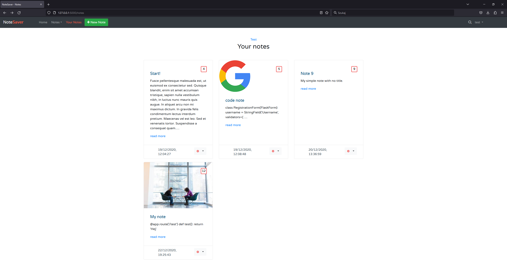

# flask-notesaver
Note saving platform written with Flask that uses SQLite for storage.

# Preview

# How to run?
1. Build docker image
`docker image build -t notesaver .`
2. Run docker container
`docker run -p 5000:5000 notesaver`
3. Go to http://localhost:5000
4. You are ready to use notesaver!
